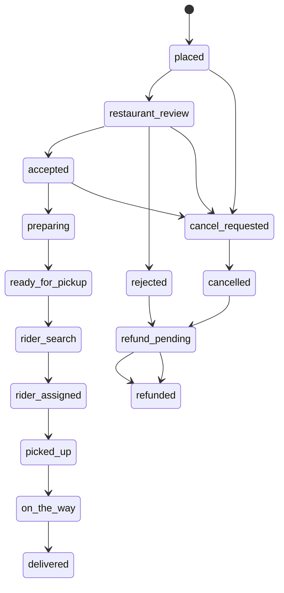

# AGENTS.md — Restaurant & Food Ordering Platform

## 1. Document Purpose

This file is the primary implementation instruction for an AI coding agent working on the **Restaurant & Food Ordering Platform** frontend.

The agent must use this document as the source of truth for:

- product scope;
- user roles and permissions;
- frontend architecture;
- routes and screens;
- domain models;
- business workflows;
- mock API contracts;
- real-time behavior;
- milestone delivery;
- testing and acceptance criteria;
- code quality and handoff requirements.

The project is a multi-restaurant food ordering and delivery management platform similar in workflow to common food-delivery marketplaces, but it must use original branding, UI, code, and content.

This is a **frontend-first project**. The application must be fully demonstrable without a production backend by using typed mock services, seeded data, simulated delays, and simulated real-time events. The architecture must allow a real backend to replace the mock implementation later without rewriting pages or stores.

---

## 2. Agent Mission

Build a production-quality, responsive frontend covering all ten required modules and four operational experiences:

1. **Customer application** — browse restaurants, build a single-restaurant cart, place and track orders, manage addresses, promotions, and loyalty points.
2. **Restaurant and kitchen workspace** — manage restaurant branches and menus, accept or reject orders, estimate preparation time, and update kitchen states.
3. **Rider workspace** — manage availability, receive delivery offers, navigate delivery tasks, update trip status, and view earnings.
4. **Platform administration dashboard** — manage roles, permissions, restaurants, branches, customers, riders, zones, fees, promotions, logs, and analytics.

The result must feel like a complete working system rather than a collection of disconnected pages.

---

## 3. Required Technology Stack

Use the following stack unless the existing repository already contains an equivalent approved setup:

- **Vue 3** with Composition API and `<script setup>`;
- **TypeScript** with strict mode enabled;
- **Vite** for development and production builds;
- **Tailwind CSS** for styling;
- **Vue Router** for client-side routing;
- **Pinia** for application state;
- **Vitest** and Vue Test Utils for unit/component tests;
- **Playwright** for critical end-to-end flows;
- **ESLint** and **Prettier** for code quality;
- a typed validation approach such as Zod, Valibot, or a project-local schema layer;
- native `fetch` or a small HTTP client wrapped by project service interfaces.

Do not couple UI components directly to the mock implementation. Pages and stores must call interfaces in `src/services`.

Do not add a large dependency when a small project-local utility is sufficient.

---

## 4. Core Product Rules

The following rules are mandatory:

1. A customer cart may contain items from **one restaurant branch only**.
2. Adding an item from another restaurant must display a confirmation dialog explaining that the current cart will be cleared.
3. Restaurant menus may contain categories, items, branch-specific prices, modifier groups, modifier choices, images, and availability states.
4. Kitchen staff must accept or reject new orders and provide a preparation-time estimate when accepting.
5. Order status changes must follow the approved state machine. Invalid transitions must be blocked.
6. Rider assignment must consider rider availability and simulated geographic proximity.
7. Delivery fees must be calculated from delivery zones, distance tiers, surge rules, free-delivery thresholds, and applicable promotions.
8. Every sensitive operational change must create an activity-log entry with a millisecond timestamp.
9. The UI must support loading, empty, error, permission-denied, offline, and success states.
10. Client-side permission checks improve UX but must never be described as a replacement for backend authorization.
11. All ten modules are in project scope. Modules marked with a star in the original requirement—Role & Permission Management and Activity Log—are foundational and must not be deferred.
12. The interface must be responsive from mobile screens through large desktop dashboards.

---

## 5. Product Scope

### 5.1 In Scope

- authentication UI and demo sessions;
- role-aware layouts and route guards;
- role and permission management;
- time-window operational access UI;
- activity logging and export;
- restaurant and branch management;
- partner verification and suspension;
- operating hours and holiday closures;
- menu categories, items, modifiers, images, prices, and availability;
- customer restaurant discovery and search;
- cart and checkout;
- kitchen order queue;
- order tracking timeline;
- rider profiles, availability, assignment, delivery tasks, and earnings;
- delivery zones, distance fees, surge pricing, and free-delivery thresholds;
- customers, addresses, order history, blacklist state, and loyalty points;
- promotions, vouchers, loyalty rules, and redemption analytics;
- operational and revenue analytics;
- realistic mock API and real-time event simulation;
- automated tests for critical behavior;
- project documentation and demo accounts.

### 5.2 Out of Scope for the Frontend Delivery

Do not implement real:

- payment gateway processing;
- SMS, push-notification, or email delivery;
- GPS tracking from a physical rider device;
- route optimization from a paid mapping service;
- identity verification;
- secure authentication tokens issued by a server;
- permanent database storage;
- financial settlement;
- production-grade fraud detection.

Instead, provide clean adapters, mock screens, and simulated outcomes for these integrations.

---

## 6. User Roles

### 6.1 Platform Admin

Full platform access. Manages users, roles, permissions, restaurants, branches, riders, customers, delivery zones, promotions, logs, analytics, and system settings.

### 6.2 Operations Manager

Manages live operations, dispatch, order exceptions, restaurant status, customer issues, promotions, zones, and reports. Cannot change protected platform-owner settings unless granted permission.

### 6.3 Restaurant Owner

Manages only assigned restaurant organizations and branches, including operating hours, menus, staff visibility, promotions, orders, and restaurant-level analytics.

### 6.4 Branch Manager

Manages assigned branches, menu availability, branch pricing, operating hours, and branch orders.

### 6.5 Kitchen Staff

Views and processes the kitchen order queue for assigned branches. Access may be restricted to scheduled shifts or configured time windows.

### 6.6 Delivery Rider

Manages personal availability, receives delivery offers, processes assigned deliveries, views trip history, and reviews earnings.

### 6.7 Customer

Browses restaurants and menus, manages a cart and checkout, tracks orders, manages profile and addresses, and uses promotions and loyalty points.

### 6.8 Support Agent

Views customers, orders, activity history, and dispute information. May initiate approved cancellation or refund workflows based on permission.

---

## 7. Permission Model

Use explicit permission keys rather than role-name checks inside components.

Suggested permission naming convention:

```text
resource.action
resource.scope.action
```

Required permission examples:

```text
roles.read
roles.create
roles.update
roles.delete
permissions.assign
permissions.revoke
activity_logs.read
activity_logs.export
restaurants.read
restaurants.create
restaurants.update
restaurants.suspend
restaurants.delete
branches.manage
menus.read
menus.manage
menus.availability.update
orders.read
orders.create
orders.accept
orders.reject
orders.status.update
orders.cancel
orders.refund.approve
dispatch.read
dispatch.assign
riders.read
riders.manage
riders.status.update
zones.read
zones.manage
fees.manage
surge.manage
customers.read
customers.manage
customers.blacklist
promotions.read
promotions.manage
loyalty.manage
analytics.read
reports.export
```

### 7.1 Time-Sensitive Access

A role assignment may optionally contain:

- valid date range;
- allowed days of week;
- start and end time;
- branch scope;
- timezone;
- temporary-expiration timestamp.

The frontend must:

- display whether access is active, scheduled, expired, or outside the allowed shift;
- prevent navigation to operational pages when access is inactive;
- display a clear message with the next allowed window;
- allow admins to configure time windows;
- log changes to time-sensitive access.

### 7.2 Route Authorization

Each protected route must define permission metadata.

Example:

```ts
{
  path: '/admin/restaurants',
  component: () => import('@/pages/admin/restaurants/RestaurantListPage.vue'),
  meta: {
    requiresAuth: true,
    permissions: ['restaurants.read'],
  },
}
```

A global router guard must validate:

1. authentication;
2. active account state;
3. active time window when required;
4. required permissions;
5. tenant, restaurant, or branch scope.

---

## 8. Application Topology

Build one Vue SPA with role-aware route namespaces and layouts.

### 8.1 Route Areas

```text
/                       Customer storefront
/auth/*                  Authentication and account recovery UI
/customer/*              Customer account area
/admin/*                 Platform administration
/partner/*               Restaurant owner and branch management
/kitchen/*               Kitchen operations
/rider/*                 Rider operations
/forbidden                Permission denied
/not-found                Route not found
```

### 8.2 Layouts

Create these layouts:

- `CustomerLayout`
- `CustomerAccountLayout`
- `AdminLayout`
- `PartnerLayout`
- `KitchenLayout`
- `RiderLayout`
- `AuthLayout`
- `BlankLayout`

Dashboards must have:

- collapsible sidebar;
- top navigation;
- global search where relevant;
- role and branch context selector;
- notification center;
- profile menu;
- breadcrumb navigation;
- responsive mobile drawer.

---

## 9. Recommended Project Structure

```text
src/
  app/
    App.vue
    bootstrap.ts
    providers/
  assets/
    icons/
    images/
  components/
    base/
    data-display/
    feedback/
    forms/
    layout/
    maps/
    navigation/
    orders/
    restaurants/
  composables/
  constants/
  domain/
    activity-log/
    auth/
    customer/
    delivery/
    menu/
    order/
    promotion/
    restaurant/
    rider/
    role/
  layouts/
  mocks/
    database/
    factories/
    handlers/
    realtime/
    seed/
  pages/
    admin/
    auth/
    customer/
    kitchen/
    partner/
    rider/
  router/
    guards/
    routes/
  services/
    contracts/
    http/
    mock/
    realtime/
  stores/
  styles/
  types/
  utils/
  validators/
  main.ts

tests/
  e2e/
  fixtures/
  unit/
```

Feature-specific components should remain near their domain when they are not reusable globally.

---

## 10. Design and User Experience Standard

### 10.1 Visual Direction

Create an original, clean food-commerce design with:

- warm neutral surfaces;
- a strong primary brand color;
- clear success, warning, danger, and informational states;
- high-quality food imagery placeholders;
- rounded cards used consistently but not excessively;
- clear typography hierarchy;
- compact data tables in operations screens;
- touch-friendly controls in customer and rider mobile views.

Define design tokens through CSS variables and Tailwind theme configuration. Do not scatter arbitrary color values throughout components.

### 10.2 Responsive Breakpoints

At minimum support:

- mobile: 360px and above;
- tablet: 768px and above;
- laptop: 1024px and above;
- desktop: 1280px and above;
- wide dashboard: 1536px and above.

### 10.3 Reusable UI Components

Implement reusable primitives before duplicating markup:

- buttons and icon buttons;
- inputs, textareas, selects, comboboxes, date/time controls;
- checkboxes, radio groups, switches;
- form field wrapper and validation message;
- badge and status pill;
- card;
- modal and confirmation dialog;
- drawer and sheet;
- dropdown menu;
- tabs;
- table with pagination, filters, sorting, and row actions;
- skeleton loaders;
- empty state;
- alert and toast;
- pagination;
- breadcrumb;
- avatar;
- image uploader preview;
- metric card;
- chart container;
- map placeholder/provider wrapper;
- order timeline;
- permission guard component.

### 10.4 Accessibility

Required:

- semantic HTML;
- keyboard-accessible menus, dialogs, tabs, tables, and forms;
- visible focus indicators;
- labels for every form control;
- appropriate ARIA only where native semantics are insufficient;
- color must not be the only status indicator;
- sufficient contrast;
- reduced-motion support;
- screen-reader announcements for toast and real-time status updates.

---

## 11. Domain Models

Use UUID-like string IDs in mocks. Store timestamps as ISO 8601 strings.

### 11.1 Authentication and Authorization

```ts
interface User {
  id: string
  email: string
  firstName: string
  lastName: string
  phone?: string
  avatarUrl?: string
  status: 'active' | 'invited' | 'suspended' | 'disabled'
  roleAssignments: RoleAssignment[]
  createdAt: string
  updatedAt: string
}

interface Role {
  id: string
  name: string
  code: string
  description?: string
  isSystem: boolean
  permissionKeys: string[]
  createdAt: string
  updatedAt: string
}

interface RoleAssignment {
  id: string
  userId: string
  roleId: string
  restaurantIds?: string[]
  branchIds?: string[]
  accessWindow?: AccessWindow
}

interface AccessWindow {
  timezone: string
  validFrom?: string
  validUntil?: string
  allowedDays?: number[]
  startTime?: string
  endTime?: string
}
```

### 11.2 Restaurant and Branch

```ts
interface Restaurant {
  id: string
  name: string
  slug: string
  description: string
  logoUrl?: string
  coverUrl?: string
  cuisineTags: string[]
  partnerStatus: 'pending' | 'verified' | 'rejected' | 'suspended'
  suspensionReason?: string
  commissionRate: number
  rating: number
  reviewCount: number
  branches: BranchSummary[]
  createdAt: string
  updatedAt: string
}

interface Branch {
  id: string
  restaurantId: string
  name: string
  phone: string
  address: Address
  coordinates: Coordinates
  operatingHours: WeeklySchedule
  holidayClosures: HolidayClosure[]
  status: 'open' | 'closed' | 'paused' | 'suspended'
  averagePrepMinutes: number
  minimumOrderAmount: number
}
```

### 11.3 Menu

```ts
interface MenuCategory {
  id: string
  restaurantId: string
  name: string
  description?: string
  sortOrder: number
  isActive: boolean
}

interface MenuItem {
  id: string
  restaurantId: string
  categoryId: string
  name: string
  description: string
  imageUrl?: string
  basePrice: number
  branchPrices: Record<string, number>
  modifierGroupIds: string[]
  dietaryTags: string[]
  preparationMinutes?: number
  isActive: boolean
  availabilityByBranch: Record<string, boolean>
}

interface ModifierGroup {
  id: string
  restaurantId: string
  name: string
  selectionType: 'single' | 'multiple'
  isRequired: boolean
  minSelections: number
  maxSelections: number
  options: ModifierOption[]
}

interface ModifierOption {
  id: string
  name: string
  priceDelta: number
  isAvailable: boolean
}
```

### 11.4 Customer and Address

```ts
interface Customer {
  id: string
  userId: string
  displayName: string
  phone: string
  addresses: Address[]
  loyaltyPoints: number
  status: 'active' | 'blacklisted' | 'deleted'
  blacklistReason?: string
  createdAt: string
}

interface Address {
  id: string
  label: string
  recipientName: string
  phone: string
  line1: string
  line2?: string
  city: string
  district?: string
  postalCode?: string
  instructions?: string
  coordinates: Coordinates
  isDefault: boolean
}

interface Coordinates {
  latitude: number
  longitude: number
}
```

### 11.5 Order

```ts
type OrderStatus =
  | 'pending_payment'
  | 'placed'
  | 'restaurant_review'
  | 'rejected'
  | 'accepted'
  | 'preparing'
  | 'ready_for_pickup'
  | 'rider_search'
  | 'rider_assigned'
  | 'picked_up'
  | 'on_the_way'
  | 'delivered'
  | 'cancel_requested'
  | 'cancelled'
  | 'refund_pending'
  | 'refunded'

interface Order {
  id: string
  orderNumber: string
  customerId: string
  restaurantId: string
  branchId: string
  items: OrderItem[]
  deliveryAddress: AddressSnapshot
  pricing: OrderPricing
  status: OrderStatus
  paymentMethod: 'cash' | 'card_mock' | 'wallet_mock'
  paymentStatus: 'unpaid' | 'authorized' | 'paid' | 'failed' | 'refunded'
  promotionIds: string[]
  loyaltyPointsEarned: number
  loyaltyPointsRedeemed: number
  estimatedPrepMinutes?: number
  estimatedDeliveryAt?: string
  assignedRiderId?: string
  rejectionReason?: string
  cancellationReason?: string
  customerNote?: string
  timeline: OrderTimelineEvent[]
  createdAt: string
  updatedAt: string
}

interface OrderItem {
  id: string
  menuItemId: string
  name: string
  imageUrl?: string
  quantity: number
  unitPrice: number
  modifiers: OrderItemModifier[]
  subtotal: number
}

interface OrderPricing {
  itemSubtotal: number
  modifierSubtotal: number
  deliveryFee: number
  serviceFee: number
  surgeFee: number
  discountTotal: number
  loyaltyDiscount: number
  taxTotal: number
  grandTotal: number
  currency: string
}
```

### 11.6 Rider and Delivery

```ts
interface Rider {
  id: string
  userId: string
  displayName: string
  phone: string
  vehicleType: 'motorbike' | 'bicycle' | 'car'
  vehiclePlate?: string
  status: 'offline' | 'available' | 'offered' | 'assigned' | 'delivering' | 'suspended'
  currentCoordinates?: Coordinates
  rating: number
  completedTrips: number
  activeDeliveryIds: string[]
}

interface DeliveryAssignment {
  id: string
  orderId: string
  riderId: string
  status: 'offered' | 'accepted' | 'declined' | 'pickup' | 'delivery' | 'completed' | 'cancelled'
  offeredAt: string
  acceptedAt?: string
  pickedUpAt?: string
  deliveredAt?: string
  estimatedDistanceKm: number
  earnings: number
}
```

### 11.7 Delivery Zone and Fee

```ts
interface DeliveryZone {
  id: string
  name: string
  branchIds: string[]
  shapeType: 'radius' | 'polygon'
  center?: Coordinates
  radiusKm?: number
  polygon?: Coordinates[]
  isActive: boolean
  feeTiers: FeeTier[]
  surgeRules: SurgeRule[]
  freeDeliveryThreshold?: number
}

interface FeeTier {
  id: string
  minDistanceKm: number
  maxDistanceKm?: number
  fee: number
}

interface SurgeRule {
  id: string
  name: string
  daysOfWeek: number[]
  startTime: string
  endTime: string
  multiplier: number
  isActive: boolean
}
```

### 11.8 Promotion and Loyalty

```ts
interface Promotion {
  id: string
  code: string
  name: string
  description: string
  scope: 'platform' | 'restaurant' | 'branch'
  restaurantIds?: string[]
  branchIds?: string[]
  discountType: 'percentage' | 'fixed' | 'free_delivery'
  discountValue: number
  maximumDiscount?: number
  minimumSpend?: number
  firstOrderOnly: boolean
  usageLimitTotal?: number
  usageLimitPerCustomer?: number
  startsAt: string
  endsAt: string
  status: 'draft' | 'scheduled' | 'active' | 'paused' | 'expired'
  redemptionCount: number
}

interface LoyaltyRule {
  id: string
  name: string
  earnPointsPerCurrencyUnit: number
  redemptionValuePerPoint: number
  minimumRedeemPoints: number
  maximumRedeemPercentage: number
  isActive: boolean
}
```

### 11.9 Activity Log

```ts
interface ActivityLog {
  id: string
  occurredAt: string
  actorUserId?: string
  actorRole?: string
  action: string
  resourceType: string
  resourceId?: string
  restaurantId?: string
  branchId?: string
  orderId?: string
  severity: 'info' | 'warning' | 'critical'
  summary: string
  metadata: Record<string, unknown>
  before?: Record<string, unknown>
  after?: Record<string, unknown>
}
```

---

## 12. Customer Application

### 12.1 Customer Routes

```text
/                                  Home and restaurant discovery
/restaurants                        Restaurant listing
/restaurants/:restaurantSlug        Restaurant details and menu
/cart                               Cart
/checkout                           Checkout
/order-confirmation/:orderId        Order confirmation
/track/:orderId                     Public/authenticated tracking
/customer/profile                   Profile
/customer/addresses                 Saved addresses
/customer/orders                    Order history
/customer/orders/:orderId           Order details
/customer/loyalty                   Loyalty balance and history
/customer/promotions                Available promotions
/customer/notifications             Notification center
```

### 12.2 Home and Restaurant Discovery

Include:

- delivery-location selector;
- search by restaurant or food item;
- cuisine chips;
- promotional banner area;
- nearby restaurants;
- top rated;
- fastest delivery;
- free-delivery offers;
- currently open filter;
- skeleton and empty states.

Restaurant cards must show:

- cover/logo;
- name;
- cuisine tags;
- rating and review count;
- estimated delivery time;
- delivery fee or free delivery;
- distance;
- open/closed status;
- active promotion badge.

### 12.3 Restaurant Menu Page

Include:

- restaurant header;
- branch selector when multiple branches serve the customer;
- operating state;
- minimum order;
- delivery estimate and fee;
- category navigation;
- menu search;
- availability indicators;
- item cards;
- sticky cart summary;
- mobile bottom cart bar.

Item detail modal or drawer must support:

- image;
- description;
- quantity;
- required and optional modifiers;
- selection-limit validation;
- special instructions;
- calculated item total;
- add/update cart action.

### 12.4 Cart

Required behavior:

- one restaurant branch per cart;
- edit quantity and modifiers;
- remove item;
- restaurant minimum-order progress;
- voucher input;
- subtotal preview;
- delivery address preview;
- clear-cart confirmation;
- unavailable-item warning;
- branch-closed warning;
- checkout button disabled with an explanation when invalid.

Persist the demo cart in local storage with schema/version handling.

### 12.5 Checkout

Sections:

1. contact information;
2. delivery address;
3. delivery instructions;
4. item summary;
5. promotion selection;
6. loyalty-points redemption;
7. payment method mock;
8. full price breakdown;
9. terms confirmation;
10. place-order action.

Before placing the order, revalidate:

- restaurant and branch status;
- operating hours;
- item availability;
- modifier availability;
- current prices;
- delivery-zone coverage;
- promotion eligibility;
- minimum order;
- calculated totals.

### 12.6 Customer Order Tracking

Show:

- current state and clear next step;
- restaurant information;
- estimated preparation time;
- rider information after assignment;
- mock map and route progression;
- status timeline;
- order items and total;
- contact/support actions;
- cancellation request when allowed;
- “order again” action after completion.

---

## 13. Platform Admin Dashboard

### 13.1 Admin Routes

```text
/admin/dashboard
/admin/roles
/admin/roles/new
/admin/roles/:roleId
/admin/users
/admin/activity-logs
/admin/restaurants
/admin/restaurants/new
/admin/restaurants/:restaurantId
/admin/branches
/admin/orders
/admin/orders/:orderId
/admin/dispatch
/admin/riders
/admin/riders/:riderId
/admin/zones
/admin/zones/:zoneId
/admin/customers
/admin/customers/:customerId
/admin/promotions
/admin/promotions/:promotionId
/admin/loyalty
/admin/analytics/operations
/admin/analytics/revenue
/admin/reports
/admin/settings
```

### 13.2 Admin Dashboard Widgets

Display:

- orders today;
- gross order value;
- platform commission;
- active restaurants;
- available riders;
- average preparation time;
- average delivery time;
- cancellation rate;
- SLA warning count;
- live order-state distribution;
- hourly orders chart;
- revenue trend;
- restaurants requiring verification;
- operational alerts;
- recent activity logs.

Use mock data generated from the same central mock database used by list pages.

---

## 14. Module 1 — Role & Permission Management

### 14.1 Required Functions

- create role;
- read/list roles;
- update role;
- delete non-system role;
- assign permissions;
- revoke permissions;
- assign roles to users;
- configure restaurant/branch scope;
- configure time-sensitive operational access;
- view effective permissions;
- audit role and permission changes.

### 14.2 Screens

- role list;
- role details;
- role create/edit form;
- permission matrix;
- user-role assignment drawer;
- access-window editor;
- effective-access preview.

### 14.3 Rules

- system roles cannot be deleted;
- a role code must be unique;
- dangerous permissions should display a warning;
- permission groups must be searchable and collapsible;
- deleting a custom role requires reassignment or removal from users;
- all role changes generate activity logs.

### 14.4 Acceptance Criteria

- an admin can create a role and select permissions;
- an admin can assign that role to a user with a branch scope;
- a kitchen user outside the configured shift is denied operational access;
- effective permissions are correctly calculated and displayed;
- protected routes and action buttons respond to permission changes.

---

## 15. Module 2 — Activity Log

### 15.1 Required Functions

- view log;
- filter by role, actor, restaurant, branch, order, resource, severity, and date;
- log order state transitions;
- log rider dispatch events;
- log menu edits;
- log refund approvals;
- export filtered logs;
- inspect before/after values and metadata.

### 15.2 Screens

- activity log table;
- activity log detail drawer;
- saved-filter presets;
- export dialog.

### 15.3 Required Log Events

At minimum create logs for:

- login/demo-session changes;
- role create/update/delete;
- permission assignment/revocation;
- restaurant verification/suspension;
- branch updates;
- menu category/item/modifier changes;
- item availability changes;
- order creation and every order transition;
- order rejection/cancellation;
- refund approval;
- rider status changes;
- dispatch offer/accept/decline/reassignment;
- zone and fee changes;
- promotion changes;
- customer blacklist changes;
- report exports.

### 15.4 Acceptance Criteria

- every operational action produces a timestamped log;
- filters update results correctly;
- detailed log view shows actor, target, metadata, before, and after;
- export produces a downloadable CSV using the active filters;
- timestamps include millisecond precision.

---

## 16. Module 3 — Restaurant & Branch Management

### 16.1 Required Functions

- create restaurant;
- view restaurant;
- update information;
- delete when allowed;
- suspend/reactivate restaurant;
- manage branch locations;
- set operating hours;
- add holiday closures;
- manage cuisine tags;
- verify/reject partner onboarding.

### 16.2 Restaurant List

Support:

- search;
- status filters;
- cuisine filters;
- verification filters;
- pagination;
- sorting;
- bulk status actions where safe;
- quick view.

### 16.3 Restaurant Detail Tabs

- overview;
- branches;
- menus;
- staff/access;
- promotions;
- orders;
- analytics;
- activity.

### 16.4 Operating Hours

Support:

- multiple opening intervals per day;
- closed days;
- copy one day’s hours to other days;
- overnight operating intervals;
- holiday closures;
- temporary pause;
- live open/closed calculation.

### 16.5 Suspension Workflow

Require:

- reason;
- internal note;
- effective time;
- optional review date;
- customer-facing status message;
- confirmation dialog;
- activity log.

Suspension must prevent new orders in the customer app while preserving historic data.

---

## 17. Module 4 — Menu & Item Management

### 17.1 Required Functions

- create menu category;
- view menu;
- update item;
- delete/archive item;
- manage modifier groups;
- toggle item availability;
- upload/preview item image;
- manage branch-specific price and availability;
- reorder categories and items.

### 17.2 Menu Builder

Use a two- or three-pane management experience on desktop and a stacked experience on mobile/tablet.

Recommended layout:

- category list;
- selected category items;
- item editor drawer.

### 17.3 Item Form Fields

- name;
- description;
- category;
- base price;
- branch prices;
- image;
- dietary tags;
- modifier groups;
- estimated preparation time;
- active state;
- branch availability.

### 17.4 Modifier Rules

Validate:

- single versus multiple selection;
- required selection;
- minimum and maximum selections;
- option availability;
- option price delta;
- duplicate option names within a group.

### 17.5 Active-Service Restriction

When configured, menu structural edits must be restricted during active service hours. The UI may still allow quick sold-out/availability toggles.

Display:

- why editing is restricted;
- when editing becomes available;
- which quick actions remain allowed.

---

## 18. Module 5 — Order & Kitchen Management

### 18.1 Required Functions

- create order;
- view order queue;
- update order status;
- cancel order;
- accept/reject order;
- estimate preparation time;
- manage order queue;
- notify dispatch when order is ready.

### 18.2 Kitchen Routes

```text
/kitchen/queue
/kitchen/orders/:orderId
/kitchen/history
/kitchen/settings
```

### 18.3 Kitchen Queue Columns

Use operational columns such as:

- New;
- Accepted;
- Preparing;
- Ready for Pickup;
- Completed/Handed Off.

The kitchen view must support:

- audible/visual new-order notification with accessible fallback;
- elapsed-time timer;
- SLA color and icon warning;
- item and modifier summary;
- customer notes;
- accept action with preparation estimate;
- reject action with reason;
- status update actions;
- branch filter;
- compact and expanded cards.

### 18.4 Order Status State Machine



The exact transition rules must be defined in one shared domain utility, not repeated across pages.

Example:

```ts
const allowedTransitions: Record<OrderStatus, OrderStatus[]> = {
  pending_payment: ['placed', 'cancelled'],
  placed: ['restaurant_review', 'cancel_requested'],
  restaurant_review: ['accepted', 'rejected', 'cancel_requested'],
  accepted: ['preparing', 'cancel_requested'],
  preparing: ['ready_for_pickup'],
  ready_for_pickup: ['rider_search'],
  rider_search: ['rider_assigned'],
  rider_assigned: ['picked_up'],
  picked_up: ['on_the_way'],
  on_the_way: ['delivered'],
  delivered: [],
  rejected: ['refund_pending'],
  cancel_requested: ['cancelled'],
  cancelled: ['refund_pending'],
  refund_pending: ['refunded'],
  refunded: [],
}
```

Adjust only when business logic requires it, and update tests and documentation together.

### 18.5 Rejection and Cancellation

Use structured reasons plus optional notes.

Examples:

- item unavailable;
- kitchen overloaded;
- restaurant closing;
- invalid delivery area;
- customer requested;
- duplicate order;
- operational issue;
- other.

Display whether a mock refund is required.

---

## 19. Module 6 — Rider & Dispatch Management

### 19.1 Required Functions

- create rider profile;
- view rider list;
- update rider status;
- delete/suspend rider;
- assign delivery;
- track delivery;
- calculate earnings per trip;
- view rider performance;
- support delivery batching in the UI model.

### 19.2 Admin Dispatch Board

Include:

- unassigned orders;
- offered orders;
- active deliveries;
- completed deliveries;
- rider availability list;
- map/provider panel;
- suggested rider ranking;
- manual assignment;
- reassignment workflow;
- dispatch event history.

### 19.3 Rider Assignment Score

Implement a transparent mock scoring function. Example inputs:

- distance to branch;
- rider availability;
- current active delivery count;
- vehicle type;
- rider acceptance rate;
- recent declined offers;
- branch/rider restrictions.

Example conceptual formula:

```text
score =
  proximityScore * 0.55 +
  availabilityScore * 0.20 +
  workloadScore * 0.15 +
  performanceScore * 0.10
```

The UI must show why a rider is suggested. Do not present the mock score as a production dispatch algorithm.

### 19.4 Rider Routes

```text
/rider/home
/rider/offers
/rider/deliveries/:deliveryId
/rider/history
/rider/earnings
/rider/profile
```

### 19.5 Rider Workflow

1. Rider switches to available.
2. System offers an order.
3. Rider accepts or declines within a simulated countdown.
4. Accepted task shows restaurant pickup details.
5. Rider confirms arrival at restaurant.
6. Rider confirms pickup.
7. Rider sees customer delivery details.
8. Rider confirms arrival and delivery.
9. Earnings and performance metrics update.
10. Activity logs are generated for each step.

### 19.6 Earnings

Mock earnings may include:

- base trip amount;
- distance amount;
- surge bonus;
- batch bonus;
- tips mock;
- adjustment;
- total.

Provide daily, weekly, and per-trip views.

---

## 20. Module 7 — Delivery Zone & Fee Management

### 20.1 Required Functions

- create delivery zone;
- view zone map;
- update boundaries;
- delete/deactivate zone;
- set fee tiers;
- apply surge pricing;
- set free-delivery threshold;
- test an address against a zone;
- preview fee calculation.

### 20.2 Zone Editor

The provider abstraction must support:

- radius zones;
- polygon zones;
- branch origin marker;
- simulated draggable points or coordinate entry;
- coverage validation;
- zone overlap warning;
- customer-address test point.

If a real map package is not configured, provide a polished map placeholder with coordinate-based editing and a future provider interface.

### 20.3 Delivery Fee Calculation

Create a pure, tested function.

Conceptual sequence:

1. Determine the serving branch.
2. Confirm the customer coordinates are inside an active zone.
3. Calculate mock straight-line distance using the Haversine formula.
4. Select the matching fee tier.
5. Apply an active surge multiplier or fixed surge fee.
6. Apply free-delivery threshold if eligible.
7. Apply promotion overrides.
8. Return a detailed fee breakdown and explanation.

Example result:

```ts
interface DeliveryFeeQuote {
  isServiceable: boolean
  zoneId?: string
  distanceKm?: number
  baseFee: number
  surgeFee: number
  promotionDiscount: number
  finalFee: number
  reason?: string
  explanation: string[]
}
```

---

## 21. Module 8 — Customer & Address Management

### 21.1 Required Functions

- create customer account;
- view profile;
- update information;
- delete account UI workflow;
- save multiple delivery addresses;
- view order history;
- manage loyalty points;
- blacklist/unblacklist abusive customers;
- view customer activity and support notes.

### 21.2 Admin Customer Detail Tabs

- overview;
- addresses;
- orders;
- loyalty;
- promotions/redemptions;
- support notes;
- activity.

### 21.3 Blacklist Workflow

Require:

- reason;
- evidence/reference note;
- start date;
- optional expiry;
- internal note;
- confirmation;
- activity log.

A blacklisted customer must be blocked from placing orders and shown an appropriate support message without exposing internal notes.

### 21.4 Account Deletion

Use a soft-delete simulation. Preserve anonymized historic order records in the mock data model.

---

## 22. Module 9 — Promotion & Loyalty Management

### 22.1 Required Functions

- create promotion;
- view promotions;
- update promotion;
- delete/archive promotion;
- manage restaurant vouchers;
- configure loyalty rules;
- track redemptions;
- support first-order campaigns;
- enforce total and per-customer usage limits.

### 22.2 Promotion Builder

Fields:

- name;
- code;
- description;
- scope;
- selected restaurants/branches;
- discount type and value;
- maximum discount;
- minimum spend;
- first-order-only switch;
- total usage limit;
- per-customer usage limit;
- start/end date and time;
- active days or time windows when needed;
- stackability policy;
- status.

### 22.3 Eligibility Engine

Create a pure function that returns eligibility and reasons.

Check:

- active date/time;
- promotion status;
- restaurant/branch scope;
- minimum spend;
- first-order requirement;
- global redemption limit;
- customer redemption limit;
- cart contents when applicable;
- stackability;
- customer status.

### 22.4 Loyalty

Support:

- points earned from completed orders;
- points redemption at checkout;
- minimum redemption amount;
- maximum percentage of an order paid with points;
- points history;
- admin adjustment with required reason;
- cancellation/refund reversal simulation.

---

## 23. Module 10 — Operations & Revenue Analytics

### 23.1 Required Functions

- view orders-per-hour heatmap;
- view delivery-time performance;
- view restaurant revenue split;
- view rider efficiency;
- view customer satisfaction trends;
- export reports.

### 23.2 Analytics Filters

Support:

- date range;
- restaurant;
- branch;
- cuisine;
- order status;
- rider;
- delivery zone;
- comparison with previous period.

### 23.3 Operations Analytics

Include:

- order volume by hour/day;
- acceptance rate;
- rejection rate;
- cancellation rate;
- average acceptance time;
- average prep time;
- average rider assignment time;
- average pickup wait time;
- average delivery time;
- percentage delivered within SLA;
- active-order bottleneck view.

### 23.4 Revenue Analytics

Include:

- gross order value;
- discounts;
- refunds;
- restaurant revenue;
- platform commission;
- delivery fees;
- rider earnings;
- net platform revenue mock;
- revenue by restaurant and branch.

### 23.5 Rider Efficiency

Include:

- trips per hour;
- acceptance rate;
- completion rate;
- average pickup time;
- average delivery time;
- distance per trip;
- earnings per hour;
- rating.

### 23.6 Export

Allow CSV export of current filtered data. Generate the file in the browser for the frontend demo.

---

## 24. Restaurant Partner Workspace

### 24.1 Routes

```text
/partner/dashboard
/partner/restaurants
/partner/branches
/partner/menu
/partner/orders
/partner/promotions
/partner/staff
/partner/analytics
/partner/settings
```

### 24.2 Partner Dashboard

Display only scoped restaurant and branch data:

- live orders;
- sales today;
- average preparation time;
- popular items;
- unavailable item count;
- active promotion performance;
- branch health;
- recent customer ratings mock.

Owners and branch managers must not access other restaurants’ data.

---

## 25. Real-Time Behavior

Create a real-time service interface:

```ts
interface RealtimeService {
  connect(): Promise<void>
  disconnect(): void
  subscribe<T>(eventName: string, handler: (payload: T) => void): () => void
  publishMock?<T>(eventName: string, payload: T): void
}
```

Mock these events:

```text
order.created
order.status_changed
order.cancel_requested
kitchen.queue_changed
menu.item_availability_changed
rider.status_changed
dispatch.offer_created
dispatch.offer_accepted
dispatch.offer_declined
delivery.location_updated
delivery.completed
activity_log.created
notification.created
```

Use deterministic timers or a mock control panel for demos. Avoid uncontrolled random changes that make tests flaky.

All subscribers must unsubscribe when components unmount.

---

## 26. State Management

Suggested Pinia stores:

```text
useAuthStore
usePermissionStore
useUiStore
useNotificationStore
useRestaurantStore
useMenuStore
useCartStore
useCheckoutStore
useOrderStore
useKitchenStore
useRiderStore
useDispatchStore
useDeliveryZoneStore
useCustomerStore
usePromotionStore
useLoyaltyStore
useActivityLogStore
useAnalyticsStore
```

Rules:

- keep server-like entities normalized where useful;
- avoid putting purely local form state into global stores;
- expose typed actions and computed getters;
- centralize loading and error handling;
- cancel or ignore stale requests during rapid filter changes;
- persist only appropriate demo state such as session, cart, selected location, and UI preferences;
- version persisted data and recover safely from invalid local storage.

---

## 27. Service Layer and Mock Backend

### 27.1 Service Interfaces

Create contracts such as:

```ts
interface RestaurantService {
  list(params: RestaurantListParams): Promise<PaginatedResult<Restaurant>>
  getById(id: string): Promise<Restaurant>
  create(input: CreateRestaurantInput): Promise<Restaurant>
  update(id: string, input: UpdateRestaurantInput): Promise<Restaurant>
  suspend(id: string, input: SuspendRestaurantInput): Promise<Restaurant>
}
```

Use the same pattern for roles, logs, menus, orders, riders, zones, customers, promotions, and analytics.

### 27.2 Mock Requirements

The mock implementation must support:

- realistic delay;
- success and failure cases;
- pagination;
- search;
- filtering;
- sorting;
- optimistic or pessimistic update behavior where appropriate;
- central mutable in-memory database;
- optional local-storage persistence;
- reset-to-seed-data action;
- deterministic scenario controls.

### 27.3 Standard Result Shapes

```ts
interface ApiSuccess<T> {
  data: T
  meta?: Record<string, unknown>
}

interface ApiError {
  code: string
  message: string
  fieldErrors?: Record<string, string[]>
  details?: Record<string, unknown>
}

interface PaginatedResult<T> {
  items: T[]
  page: number
  pageSize: number
  totalItems: number
  totalPages: number
}
```

### 27.4 Environment Configuration

Provide `.env.example` with values similar to:

```text
VITE_APP_NAME=FoodFlow Platform
VITE_API_MODE=mock
VITE_API_BASE_URL=/api
VITE_REALTIME_MODE=mock
VITE_MAP_PROVIDER=mock
VITE_DEFAULT_CURRENCY=USD
VITE_DEFAULT_TIMEZONE=Asia/Phnom_Penh
```

Do not commit secrets.

---

## 28. Authentication Demo

Provide a login page with role-based demo accounts.

Suggested seeded accounts:

```text
admin@demo.local              Platform Admin
operations@demo.local         Operations Manager
owner@demo.local              Restaurant Owner
manager@demo.local            Branch Manager
kitchen@demo.local            Kitchen Staff
rider@demo.local              Delivery Rider
customer@demo.local           Customer
support@demo.local            Support Agent
```

Use a clearly documented demo password in the local README, for example `Demo123!`. This is mock-only and must never be presented as production security.

Provide a “Quick Demo Login” selector for easier assessment.

Authentication features:

- login;
- logout;
- remember-session mock;
- forgot-password mock confirmation;
- disabled/suspended account state;
- redirect to the correct default workspace;
- return to originally requested route after login when permitted.

---

## 29. Notifications

Create in-app notifications for:

- new kitchen order;
- order accepted/rejected;
- order ready;
- rider offer;
- rider assigned;
- order picked up;
- order delivered;
- cancellation update;
- refund update;
- restaurant verification update;
- system warning.

Support read/unread status and links to relevant resources.

---

## 30. Loading, Error, and Empty States

Every list and detail page must include:

- first-load skeleton;
- refreshing indicator;
- empty-state message and relevant action;
- retryable error state;
- permission-denied state;
- not-found state;
- offline/mock-service unavailable state where applicable.

Do not leave blank pages after failed requests.

Forms must:

- validate before submission;
- display field-level errors;
- display server-style errors;
- disable repeated submissions;
- warn about unsaved changes when appropriate;
- preserve entered data after recoverable errors.

---

## 31. Performance Requirements

- use route-level lazy loading;
- avoid loading admin modules into the first customer storefront bundle where practical;
- debounce search inputs;
- paginate large tables;
- virtualize only when genuinely necessary;
- optimize responsive images;
- use stable keys in lists;
- prevent unnecessary store watchers;
- clean up real-time listeners and timers;
- keep chart and map adapters lazy-loaded;
- target a good Lighthouse experience for the customer home and restaurant pages.

---

## 32. Security and Privacy Requirements

Even in a frontend demo:

- do not store real secrets;
- do not use `v-html` for untrusted content;
- sanitize or safely render user-generated notes;
- mask sensitive customer data where a role lacks permission;
- prevent unauthorized route access in the UI;
- hide unauthorized actions;
- avoid logging sensitive payment details;
- mark all client-side authorization as presentation-layer enforcement only;
- use confirmation dialogs for destructive actions;
- require a reason for suspension, blacklist, rejection, cancellation, refund, and manual adjustments.

---

## 33. Internationalization and Formatting

Prepare the app for localization even when the first delivery is English-only.

Centralize:

- user-facing labels where practical;
- currency formatting;
- date/time formatting;
- timezone handling;
- status labels;
- validation messages.

Default timezone: `Asia/Phnom_Penh`.

Default currency may be configured. Avoid hard-coding a currency symbol into business calculations.

---

## 34. Testing Strategy

### 34.1 Unit Tests

Required for:

- order state transition rules;
- cart single-restaurant enforcement;
- cart totals;
- modifier validation;
- delivery-zone containment;
- Haversine distance calculation;
- delivery fee calculation;
- promotion eligibility;
- discount calculation;
- loyalty earning and redemption;
- permission and access-window evaluation;
- rider assignment scoring;
- date/operating-hour logic.

### 34.2 Component Tests

Required for important reusable components and feature behavior:

- item modifier selector;
- cart summary;
- permission guard;
- operating-hours editor;
- kitchen order card;
- order timeline;
- promotion form;
- fee-tier editor;
- data-table filtering state.

### 34.3 End-to-End Tests

Implement at least these flows:

1. Customer browses a restaurant, configures an item, adds it to the cart, and places an order.
2. Adding an item from another restaurant triggers the clear-cart confirmation.
3. Kitchen staff accepts the new order, sets preparation time, and marks it ready.
4. Operations assigns a rider and the rider completes pickup and delivery.
5. Customer tracking updates through the order lifecycle.
6. Admin creates a custom role and assigns a time-window restriction.
7. Unauthorized user is blocked from a protected route and action.
8. Admin creates a promotion and customer applies it successfully.
9. Admin changes a delivery fee tier and checkout reflects the new quote.
10. Activity logs show the end-to-end order and dispatch events.

Tests must use deterministic seeded data and controllable mock time/events.

---

## 35. Coding Standards

### 35.1 Vue

- use Composition API;
- use `<script setup lang="ts">`;
- keep components focused;
- avoid business logic in templates;
- use computed properties rather than duplicated derived state;
- use composables for reusable behavior;
- type props and emits;
- avoid excessive prop drilling when a scoped store or provide/inject is more appropriate;
- do not mutate props;
- clean up listeners and timers.

### 35.2 TypeScript

- enable strict mode;
- avoid `any`;
- use discriminated unions for state and status models;
- prefer domain-specific types over generic records;
- validate external/mock input before use;
- keep shared interfaces in domain or service contract modules;
- use exhaustive checks for status logic.

### 35.3 Tailwind CSS

- use shared components and design tokens;
- avoid extremely long repeated utility strings;
- extract repeated patterns into components or class utilities;
- keep responsive behavior explicit;
- do not use arbitrary values unless necessary;
- support dark mode only if implemented consistently across all major layouts; otherwise omit it from the first release.

### 35.4 Naming

- Vue components: PascalCase;
- composables: `useXxx`;
- stores: `useXxxStore`;
- services: `XxxService`;
- interfaces/types: PascalCase;
- constants: uppercase snake case only for true constants;
- route names: dot-separated or consistent camel-case naming;
- files: use the repository’s established convention consistently.

### 35.5 Comments

Comments should explain business intent, constraints, or non-obvious decisions. Do not comment obvious syntax.

---

## 36. Milestone Plan

The coding agent must implement milestones in order. Each milestone must leave the repository buildable and demonstrable.

### Milestone 0 — Project Foundation and UX System

Deliverables:

- Vue, TypeScript, Vite, Tailwind setup;
- linting and formatting;
- unit and E2E test setup;
- environment configuration;
- router and layout skeletons;
- design tokens;
- reusable UI primitives;
- mock service architecture;
- seeded mock database;
- loading/error/empty patterns;
- README setup instructions.

Exit criteria:

- application builds and runs;
- all main route namespaces load a placeholder shell;
- lint, type-check, and test commands pass;
- no page relies on hard-coded data embedded directly in the template.

### Milestone 1 — Authentication, RBAC, and Activity Foundation

Deliverables:

- demo login and session persistence;
- role-aware redirect;
- permissions and route guards;
- roles and permission management screens;
- time-sensitive access editor and evaluator;
- activity log service, list, filters, detail view, and export;
- permission-based navigation and action guards.

Exit criteria:

- demo users see only authorized workspaces;
- role and permission edits affect UI access;
- expired/out-of-window access is blocked;
- role changes are logged.

### Milestone 2 — Restaurant, Branch, and Menu Management

Deliverables:

- restaurant list/create/detail/edit;
- partner verification and suspension;
- branch management;
- operating hours and holiday closures;
- menu category management;
- item and modifier management;
- image preview/upload mock;
- branch price and availability;
- active-service edit restriction;
- partner workspace foundation.

Exit criteria:

- an admin can create and verify a restaurant with branches;
- an owner can manage only assigned restaurant data;
- menu changes appear in customer-facing mock service results;
- availability changes are logged and sent through real-time mock events.

### Milestone 3 — Customer Storefront, Cart, and Checkout

Deliverables:

- home/discovery;
- restaurant listing and filtering;
- restaurant menu page;
- item modifier selection;
- single-restaurant cart enforcement;
- address selection;
- delivery quote preview;
- checkout and payment mock;
- order creation;
- customer profile, addresses, and order history.

Exit criteria:

- customer can complete the full browse-to-order flow;
- totals and validation are correct;
- closed branches and unavailable items are handled;
- order creation writes activity and real-time events.

### Milestone 4 — Kitchen Workflow and Customer Tracking

Deliverables:

- kitchen queue;
- accept/reject flow;
- preparation estimate;
- preparation and ready states;
- status transition validation;
- customer order detail and tracking timeline;
- operational notifications;
- cancellation-request UI.

Exit criteria:

- kitchen can process a new order to ready-for-pickup;
- customer tracking updates from mock real-time events;
- invalid order transitions are blocked and tested;
- all transitions create logs.

### Milestone 5 — Rider and Dispatch

Deliverables:

- rider management;
- rider availability;
- dispatch board;
- rider recommendation scoring;
- manual assignment;
- rider offer flow;
- rider pickup/delivery workflow;
- mock location progression;
- trip earnings and history;
- delivery completion updates.

Exit criteria:

- an order can move from ready to delivered;
- operations can understand and override rider suggestions;
- rider status and earnings update correctly;
- customer tracking reflects assignment and delivery progress.

### Milestone 6 — Delivery Zones, Fees, Promotions, and Loyalty

Deliverables:

- zone list and editor;
- radius/polygon data model;
- fee tiers;
- surge rules;
- free-delivery threshold;
- delivery fee quote engine;
- promotion CRUD;
- eligibility engine;
- checkout voucher selection;
- loyalty rules, earning, redemption, and history.

Exit criteria:

- delivery serviceability and fees are deterministic and tested;
- eligible promotions correctly change checkout totals;
- usage limits are enforced in mocks;
- loyalty earning and redemption update after order lifecycle changes.

### Milestone 7 — Customers, Support Operations, and Analytics

Deliverables:

- admin customer list/detail;
- blacklist workflow;
- soft-delete simulation;
- support notes;
- operations dashboard;
- revenue dashboard;
- heatmap and SLA views;
- restaurant revenue split;
- rider efficiency;
- CSV report exports.

Exit criteria:

- customer restrictions affect checkout;
- analytics are derived from central mock data;
- filters work consistently;
- exports match active filters.

### Milestone 8 — Hardening, QA, and Handoff

Deliverables:

- critical E2E flows;
- missing unit/component tests;
- accessibility review;
- responsive review;
- error-state review;
- performance cleanup;
- demo scenario controls;
- seeded demo accounts and data documentation;
- architecture and handoff documentation;
- final acceptance checklist.

Exit criteria:

- lint, formatting, type-check, unit tests, component tests, E2E tests, and production build pass;
- no major route has a placeholder implementation;
- all ten modules can be demonstrated;
- README explains installation, commands, accounts, architecture, mock reset, and demo workflow.

---

## 37. Seed Data Requirements

Seed enough connected data to make every dashboard useful:

- at least 6 restaurants;
- at least 2 restaurants with multiple branches;
- multiple cuisines;
- operating, closed, paused, pending-verification, and suspended examples;
- at least 8 menu categories across restaurants;
- at least 40 menu items;
- modifier groups with required and optional examples;
- available and sold-out items;
- at least 12 riders with varied status and performance;
- at least 30 customers;
- saved addresses in and outside delivery zones;
- at least 50 historic orders across statuses and dates;
- at least 5 active/scheduled/expired promotions;
- delivery zones with multiple fee tiers and surge rules;
- activity logs for all major event categories;
- analytics data derived from seeded orders.

Data relationships must remain internally consistent.

---

## 38. Demo Scenarios

Provide a development-only scenario panel or documented actions for:

1. create a new customer order;
2. advance an order into the kitchen queue;
3. simulate restaurant acceptance;
4. mark order ready;
5. start rider search;
6. simulate rider acceptance;
7. advance rider location;
8. complete delivery;
9. simulate restaurant rejection;
10. simulate payment/refund state;
11. trigger surge pricing;
12. make an item sold out;
13. move a user outside an allowed access window;
14. reset all mock data.

The panel must not appear in a production-mode build unless explicitly enabled.

---

## 39. Definition of Done for Every Feature

A feature is complete only when:

- it satisfies the documented business rule;
- it uses typed domain models;
- it uses the service layer rather than embedded mock data;
- permissions are enforced in navigation and actions;
- loading, empty, error, and success states exist;
- forms are validated;
- destructive actions use confirmation;
- activity logs are generated where required;
- responsive behavior is tested;
- accessibility basics are present;
- relevant unit/component tests exist;
- no TypeScript, lint, or console errors remain;
- documentation is updated when architecture or behavior changes.

---

## 40. Repository Commands

Provide scripts equivalent to:

```json
{
  "scripts": {
    "dev": "vite",
    "build": "vue-tsc -b && vite build",
    "preview": "vite preview",
    "typecheck": "vue-tsc --noEmit",
    "lint": "eslint .",
    "lint:fix": "eslint . --fix",
    "format": "prettier --write .",
    "format:check": "prettier --check .",
    "test": "vitest run",
    "test:watch": "vitest",
    "test:e2e": "playwright test"
  }
}
```

Adapt commands to the repository’s final tooling while preserving equivalent capability.

---

## 41. Agent Execution Rules

The coding agent must follow these rules while implementing:

1. Inspect the repository before changing files.
2. Preserve working project conventions unless they conflict with this specification.
3. Implement one milestone at a time, but keep architecture compatible with later milestones.
4. Do not create fake pages containing only headings when the milestone requires working functionality.
5. Do not duplicate domain types across features.
6. Do not call mock data arrays directly from Vue pages.
7. Do not bypass permission checks for convenience.
8. Do not place business calculations only inside visual components.
9. Add tests for pure business rules before or together with their UI.
10. Run type-check, lint, tests, and build after meaningful implementation batches.
11. Fix failures before declaring a milestone complete.
12. Update README and this file if an intentional architecture decision changes.
13. Prefer complete vertical workflows over many partially implemented screens.
14. Use realistic content, not repeated lorem ipsum.
15. Clearly mark mock integrations and future backend boundaries.
16. Never commit secrets or generated build output unless the repository explicitly requires it.
17. Keep console output clean.
18. Do not remove requirements silently. Document any limitation in a `KNOWN_LIMITATIONS.md` file.

---

## 42. Recommended Implementation Sequence Within a Milestone

For each feature:

1. define or update domain types;
2. define validation and pure business rules;
3. define service contract;
4. implement mock service and seed data;
5. add store/composable orchestration;
6. build reusable feature components;
7. build route page;
8. connect permissions and activity logging;
9. add loading/error/empty states;
10. add tests;
11. verify responsive and accessible behavior;
12. update documentation.

---

## 43. Final Acceptance Checklist

The final project must demonstrate all of the following:

### Foundation

- [ ] Vue 3, TypeScript, Vite, and Tailwind are configured.
- [ ] Router, Pinia, linting, formatting, testing, and build scripts work.
- [ ] Service contracts cleanly separate UI from mock backend.
- [ ] Seed reset is available.

### Authentication and Permissions

- [ ] All demo roles can log in.
- [ ] Users are redirected to the correct workspace.
- [ ] Route and action permissions work.
- [ ] Time-sensitive access works.
- [ ] Role and permission CRUD works.

### Activity Logs

- [ ] Required events are logged.
- [ ] Filtering and detail inspection work.
- [ ] CSV export works.
- [ ] Millisecond timestamps are shown.

### Restaurant and Menu

- [ ] Restaurant and branch CRUD works.
- [ ] Verification and suspension work.
- [ ] Operating hours and closures work.
- [ ] Menu categories, items, modifiers, prices, images, and availability work.
- [ ] Service-hour editing restrictions work.

### Customer Ordering

- [ ] Restaurant discovery works.
- [ ] Menu configuration works.
- [ ] Single-restaurant cart rule works.
- [ ] Address and checkout validation work.
- [ ] Fee, promotion, loyalty, and total calculations work.
- [ ] Order creation works.

### Kitchen and Orders

- [ ] Kitchen receives new orders.
- [ ] Accept/reject and preparation estimate work.
- [ ] Queue states work.
- [ ] Invalid state transitions are blocked.
- [ ] Customer tracking updates.

### Rider and Dispatch

- [ ] Rider management works.
- [ ] Rider availability works.
- [ ] Suggested and manual assignment work.
- [ ] Offer acceptance/decline works.
- [ ] Pickup and delivery completion work.
- [ ] Earnings update.

### Zones and Fees

- [ ] Radius and polygon models are supported.
- [ ] Address serviceability works.
- [ ] Fee tiers, surge, threshold, and promotion effects work.
- [ ] Fee calculation is tested.

### Customers, Promotions, and Loyalty

- [ ] Customer profiles, addresses, order history, and blacklist work.
- [ ] Promotion CRUD and eligibility work.
- [ ] Redemption limits work.
- [ ] Loyalty earn/redeem/history work.

### Analytics

- [ ] Order heatmap exists.
- [ ] Delivery SLA analytics exist.
- [ ] Revenue split exists.
- [ ] Rider efficiency exists.
- [ ] CSV exports work with filters.

### Quality

- [ ] Major screens are responsive.
- [ ] Major workflows are keyboard accessible.
- [ ] No major loading, error, or empty state is missing.
- [ ] Unit and E2E critical paths pass.
- [ ] Type-check, lint, and production build pass.
- [ ] README and handoff documentation are complete.

---

## 44. Expected Final Handoff Files

At minimum, the repository should contain:

```text
AGENTS.md
README.md
ARCHITECTURE.md
KNOWN_LIMITATIONS.md
.env.example
src/
tests/
```

`README.md` must include:

- product overview;
- prerequisites;
- installation;
- commands;
- demo accounts;
- workspace descriptions;
- mock-data reset instructions;
- recommended demo flow;
- test instructions;
- build instructions.

`ARCHITECTURE.md` must include:

- application topology;
- folder structure;
- state and service boundaries;
- authorization approach;
- mock backend design;
- real-time design;
- future backend integration notes.

---

## 45. Final Product Principle

The system must demonstrate one connected operational story:

> A customer discovers an eligible restaurant, orders available menu items, receives an accurate delivery quote and promotion result, submits the order, the kitchen accepts and prepares it, dispatch assigns a suitable rider, the rider completes the delivery, the customer sees live progress, loyalty and earnings update, analytics change, and every important event appears in the activity log.

Prioritize this complete end-to-end experience while ensuring every required module has functional management screens and tested business behavior.
